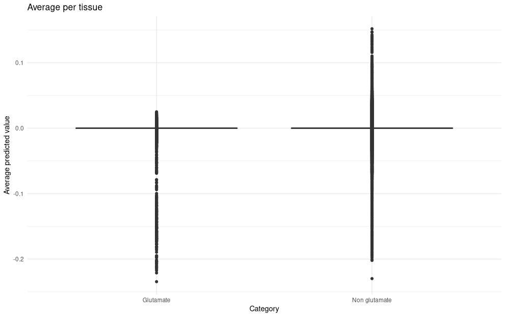

This repository contains all information related to the project
"Gene expression under human self-domestication: an in silico exploration of modern human high-frequency variants",
presented by Thomas O'Rourke, [Pedro Tiago Martins](https://ptmartins.info), and [Alejandro Andirkó](https://andirko.eu) as a student poster at the [COGSCI 2021 meeting](https://cognitivesciencesociety.org/cogsci-2021/)
(Vienna, 26th – 29th July 2021). This includes:

- references
- code
- supplementary figures
- the poster presented at the meeting
- a brief summary of what was presented, below

# Summary
**Gene expression under human self-domestication: an in silico exploration of modern human high-frequency variants**  
Thomas O'Rourke1*, Pedro Tiago Martins1,2, Alejandro Andirkó1  
1*University of Barcelona*
2*University of Ljubljana*  
*correspondence: [tomo.orouke@gmail.com](mailto:tomo.orourke@gmail.com).

note: All authors were PhD students at the University of Barcelona when the work first started. At the time of presentation, all authors had completed their PhDs.

## Convergent Human-Domesticate Evolution

Shared differences:
- craniofacial alterations
- attenuated stress signaling
- reduced reactive agression
- increased social exploration

### Domestication syndrome
### Glutamate receptors

## Hypothesis
Downregulated glutamatergic synaptic activity as a result of positive selection in modern humans.
## Methods
- Using [ExPecto](https://github.com/FunctionLab/ExPecto), we explored predicted expression resulting from high-frequency/fixed variants identified by Peyrègne et al. 2017
- We generated ≈ 1 million predicted transcriptional reads across 218 human tissues
- We compared genes enriched at the Glutamatergic Synapse (GO category [0098978](http://amigo.geneontology.org/amigo/term/GO:0098978)) with other genes targeted in recent human evolution

## Results

<strong>e.</strong> Glutamatergic signaling gene variants are significantly downregulated (p < 0.01) compared to non-glutamatergic variants when averaged across tissues (red dots).

<figure>

<figcaption><strong>f.</strong> Range of up- and downregulated expression for individual glutamatergic signaling gene versus non-glutamatergic variants. Horizontal lines at zero denote no change in expression</figcaption>
</figure>

<figure>

<figcaption><strong>g.</strong> Tendency towards downregulation of glutamatergic signaling genes across all tissues (purple) and in brain tissues (blue) versus other genes (grey)</figcaption>
</figure>

<figure>

<figcaption><strong>h.</strong> Significantly differentially expressed genes (red, FDR < 0.01), including glutamatergic signaling genes (named). Genes left of the zero are downregulated</figcaption>
</figure>
