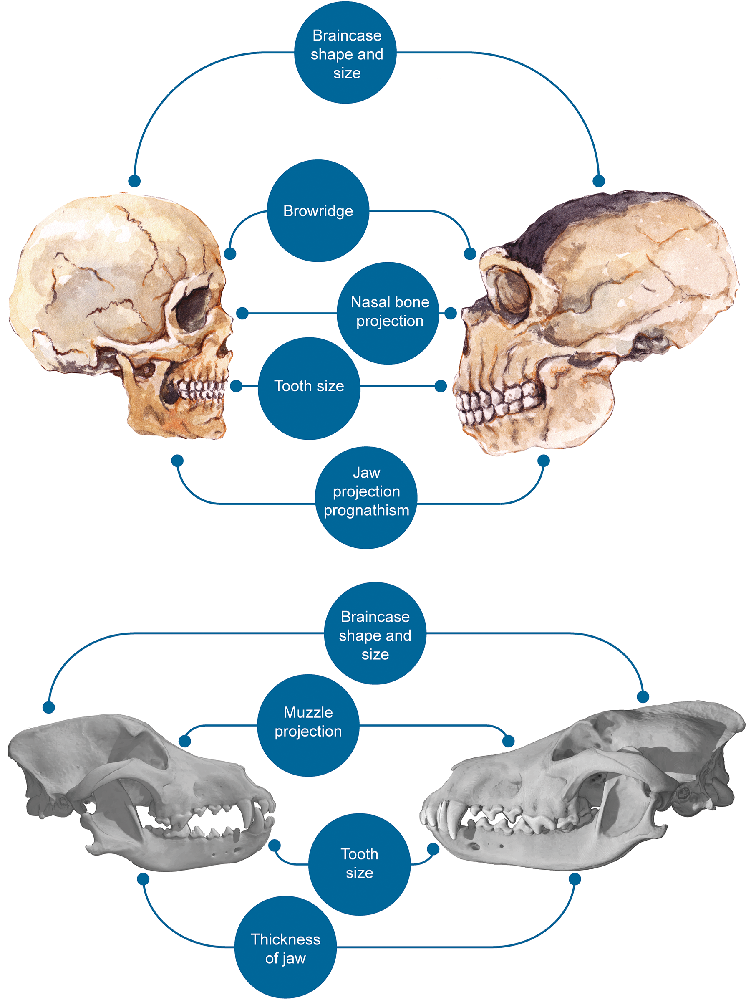
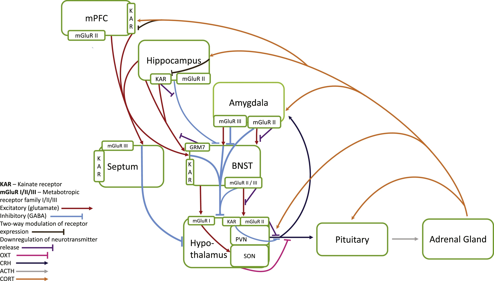

```{r setup, include=FALSE}
knitr::opts_chunk$set(echo = TRUE)
```
# Introduction

There is mounting evidence that modern humans and domesticated species have followed convergent evolutionary paths. As we have covered in previous work, this evidence includes not only shared behavioural and physiological changes, such as those illustrated in figure \@ref(fig:plosone), from @Theofanopoulou_2017, but also shared genetic changes.

```{r plosone, echo=FALSE, fig.align = 'center', fig.cap = "Salient craniofacial differences between AMH and Neanderthals (top) and between dogs and wolves (bottom).", out.width = '40%'}

```

A recent comparison of evolutionary markers on the genomes of fifteen domesticated species and modern humans found that the regulatory regions of glutamate receptor genes (in particular, their regulatory regions) show disproportionate targeting when compared to other neurotransmitter receptor systems. A summary of these findings is illustrated here in figure \@ref(fig:orourke2020), adapted from @ORourke_2020. Specifically, genes coding for receptors that downregulate glutamatergic synaptic transmission are predominantly targeted in ours and domesticated species.

```{r orourke2020, echo=FALSE, fig.align = 'center', fig.cap = " Signals of selection, introgression, high-frequency changes, or expression differences identified on glutamate and other widely expressed neurotransmitter receptor gene types.", out.width = '40%'}
knitr::include_graphics("poster/figures/Figure_2a.png")
```

Glutamate is the brain’s main excitatory signaling system. It mediates the brain response to stress as well as driving the interconnectivity of circuits supporting higher cognitive capacities. This has led to proposals, as illustrated briefly in figure \@ref(fig:orourke2021), from @ORourke_2021, that attenuated glutamate signaling, in turn downregulating the stress response, can contribute to an increase in cognitive and behavioural flexibility in our species relative to Neanderthals.

```{r orourke2021, echo=FALSE, fig.align = 'center', fig.cap = "Actions of Metabotropic and Kainate Receptors in the stress-response cascade.", out.width = '60%'}

```

# Hypothesis
A crucial premise of such proposals is that glutamatergic neurotransmission is indeed downregulated as a result of selective events. In the present study, we sought to test this hypothesis, using the deep-learning tool ExPecto [@Zhou_2018], which uses sequence variants to predict gene expression across 218 human tissues and cell types.

# Results
We used ExPecto on more than 4300 fixed or nearly fixed variants identified on or near 424 positively selected genes by @Peyregne_2017. This provided a total output of almost one million predicted variant expression reads across all tissues. In most cases multiple variants occurred on a single gene or relevant regulatory region, so we calculated the cumulative effect of these variants on gene expression.

22 of the 424 genes were part of the Gene Ontology category “glutamatergic synapse” (we used the AmiGO tool, @Carbon_2009). We compared the cumulative variant effects on expression of these 22 glutamatergic signaling genes with all the other genes, and we found a marked difference in expression patterns: Glutamatergic signaling genes showed a significant tendency, as a category, to be downregulated across tissues, while expression patterns for non-glutamatergic genes were broadly balanced between those that were up or downregulated.

This tendency is illustrated in Figures \@ref(fig:violin-glut-vs-non-glut) to \@ref(fig:diff-expr-genes), which highlight, respectively, cumulative effects on expression of glutamate versus non-glutamate genes in different tissues (Fig, \@ref(fig:violin-glut-vs-non-glut)), the range of expression of different variants (Fig. \@ref(fig:boxplot-all-variants)), the effects on expression in neural and non-neural tissues (Fig. \@ref(fig:coneplot-fig)), and individual genes with significant cumulative up- or downregulated expression (Fig. \@ref(fig:diff-expr-genes)).
These findings support theories that the attenuation of glutamatergic signaling has played a key role in recent human evolution.

# Methods

## Running ExPecto on the @Peyregne_2017 data

We used the deep-learning tool ExPecto [@Zhou_2018], which uses sequence variants to predict gene expression across 218 human tissues and cell types, on more than 4300 fixed or nearly fixed variants identified on or near 424 positively selected genes by @Peyregne_2017 (`Peyregne 2017.vcf`).

```{bash ExPecto, eval=FALSE}
#!/usr/bin/env bash

# Take the Peyregne et al data and create a pseudo-vcf
sed 's/,/\t/g' 'Peyregne 2017.vcf' | awk '{print $1, $2, "-", $4, $5}' | tail -n +2 | awk '$5=! "NA" {print $0}' | sed 's/ /\t/g' > formatted_peyregne.vcf

# from then on, follow ExPecto's intructions, detailed here: https://github.com/FunctionLab/ExPecto
git clone https://github.com/FunctionLab/ExPecto.git
mv formatted_peyregne.vcf Expecto/
cd ExPecto
sh download_resources.sh; tar xf resources_20190807.tar.gz

# Download BEDOPS (https://bedops.readthedocs.io/en/latest/) and run:
closest-features --delim '\t' --closest --dist <(awk '{printf $1"\t"$2-1"\t"$2"\n"}' formatted_peyregne.vcf|sed s/chr//g|sed s/^/chr/g|sort-bed - ) ./resources/geneanno.pc.sorted.bed > formatter_peyregne.bed.sorted.bed.closestgene

# Run ExPecto after satifying whatever dependencies you might miss (rhis might take a long timetime):
python chromatin.py formatted_peyregne.vcf 
python predict.py --coorFile formatted_peyregne.vcf  --geneFile formatted_peyregne.vcf.bed.sorted.bed.closestgene --snpEffectFilePattern formatted_peyregne.vcf.shift_SHIFT.diff.h5 --modelList ./resources/modellist --output output.csv
```

## Analyses on the output from ExPecto

For our analyses we used R [@RCoreTeam_2020], along with the following packages: `tidyverse` [@Wickham_2019], `ggrepel` [@Slowikowski_2021],`reshape2` [@Wickham_2007], `gprofiler2` [@Raudvere_2019], and `fdrtool` [@Strimmer_2008]. Figures included in the poster presentation of this work are numbered and captioned, but other figures are generated as well.

```{r libraries, message=FALSE}
library(tidyverse)
library(ggrepel)
library(reshape2)
library(gprofiler2)
library(fdrtool)
```

We performed a GO enrichment analysis on the output of ExPecto and, indentifying glutamatergic signaling genes vs. nob-glutamatergic signaling genes, a difference which was found to be significant.

```{r out_GO, message=FALSE, warning=FALSE}
#Reads ExPecto output, including all genes under positive selection according to Peyregne et al. 2017
out <- read_csv("output.csv")

#Does GO enrichment analysis of genes on those genes
go <- gprofiler2::gost(out$gene, evcodes = TRUE)
glutamate_genes <- go[["result"]][14,]
glutamate_genes <- glutamate_genes$intersection
glutamate_genes <- strsplit(glutamate_genes, split = ",")

# Divides ExPecto output into glutamate signaling variants (argument 2 = TRUE) and non-glutamatergic ones (arg2 = FALSE)
glut_res <- function(exp_output, glut){ 
  exp_output <- exp_output[9:228]
  if ( glut == TRUE){
    out <- exp_output %>% 
      filter(gene %in% glutamate_genes[[1]])
  } else if (glut == FALSE) {
    out <- exp_output %>% 
      filter(!gene %in% glutamate_genes[[1]])
  }
  mout <- melt(out)
  return(mout)
}

# Averages values by tissue, regardless of gene
avg_tissue <- function(df){
  out <- df %>% 
    group_by(variable) %>% 
    summarize(avg_value = mean(value))
  return(out)
}

# Averages values by gene and tissue
avg_gene <- function(df){
  out <- df %>% 
    group_by(gene, variable) %>% 
    summarize(avg_value = mean(value))
  return(out)
}

#Test for glut vs the rest, per tissue
# Creates two dfs, one for glutamatergic genes and one that isn't
glut <- glut_res(out, TRUE)
non_glut <- glut_res(out, FALSE)

# Average by tissue
gluttiss <-avg_tissue(glut)
NONgluttiss <-avg_tissue(non_glut)

#Test2 is a dataframe to test average value variance between the two. # Significant
test2 <- cbind(gluttiss, NONgluttiss)
colnames(test2) <- c("gluttis", "avgglut", "nongluttis", "avgnonglut")
t.test(test2$avgnonglut, test2$avgglut, 
       data=test2,
       paired=TRUE,
       conf.level=0.95)
```

```{r violin-glut-vs-non-glut, fig.align = 'center', fig.cap=" Glutamatergic signaling gene variants are significantly downregulated (p < 0.01) compared to non-glutamatergic variants when averaged across tissues (red dots)", message=FALSE, warning=FALSE}

# Generates ex profeso dataframe for boxplot
boxplot <-  NULL
boxplot$values <- c(test2$avgglut, test2$avgnonglut) 
boxplot$ids <- NA
boxplot$ids <- rep("Gutamatergic signalling", 218)
boxplot$ids[219:436] <- rep("Control", 218)
boxplot <- as.data.frame(boxplot)

# Violin plot with averages per tissue (red dots) in glutamatergic and non glutamatergic signalling genes

ggplot(boxplot, aes(ids, values))+ 
  theme_minimal() +
  geom_violin() +
  geom_jitter(aes(color = "red"), width = 0.2, alpha = 0.6) +
  labs(title="Average per tissue",
       x ="Category", y = "Average predicted value") +
  theme(legend.position = "none")
```

```{r boxplot-all-variants, fig.align = 'center', fig.align = 'center', fig.cap="Range of up- and downregulated expression for individual glutamatergic signaling gene versus non-glutamatergic variants. Horizontal lines at zero denote no change in expression", message=FALSE, warning=FALSE}

# Generates ex profeso dataframe for an extra boxplot with every variant
glut <- glut_res(out, TRUE)
non_glut <- glut_res(out, FALSE)
boxplot_everything <- NULL
boxplot_everything$values <- c(glut$value, non_glut$value)
boxplot_everything$ids <- NA
# column "ids" denotes the group to which the variant belongs (glutamate, not glutamate)
boxplot_everything$ids[1:length(glut$value)] <- rep("Glutamate", length(glut$value))
boxplot_everything$ids[length(glut$value)+1:length(non_glut$value)] <- rep("Non glutamate", length(non_glut$value))
boxplot_everything <- as.data.frame(boxplot_everything)

# Figure 2: boxplot with all variants
# Note: Might be heavy or slow due to the number of variants

ggplot(boxplot_everything, aes(ids, values))+ 
  theme_minimal() +
  geom_boxplot() +
  labs(title="Average per tissue",
       x ="Category", y = "Average predicted value") +
  theme(legend.position = "none")
```

We tested the expression per gene using a linear model, which was found to be significant.
```{r significance_per_gene, message=FALSE, warning=FALSE}
# Testing significance per gene
# Average contrast groups by tissue and gene
glutgene <-avg_gene(glut)
NONglutgene<-avg_gene(non_glut)

# Test = ex profeso dataframe
test <- NULL
test <- rbind(glutgene, NONglutgene)
test$id <- NA
test$id[1:length(glutgene$avg_value)] <- "glut"
test$id[length(glutgene$avg_value)+1:length(NONglutgene$avg_value)] <- "NONglut"

# Linear model # Significant
model <- lm(avg_value ~ id,
           data = test)
summary(model)
```

```{r cone_brain_tissues, message=FALSE, warning=FALSE}
# Plot those values that are lower than -0.01 in both groups
test <- test %>% 
  filter(avg_value < -0.01)
  
a <- ggplot(test, aes(avg_value, gene))+ 
  theme_minimal() +
  geom_violin() +
  geom_jitter() +
  labs(title="Average per tissue",
       x ="Category", y = "Average predicted value") +
  theme(legend.position = "none")

#a <- a + facet_wrap(~ id)
a
```

We also distinguish between brain-related and non-brain related genes.
```{r coneplot-fig, warning=FALSE, fig.align = 'center', fig.cap="Range of up- and downregulated expression for individual glutamatergic signaling gene versus non-glutamatergic variants. Purple denotes brain-related genes; turquoise green denotes non-brain-related genes. Horizontal lines at zero denote no change in expression"}
# Creates another ex profeso dataframe, resets "test" as null to avoid confusion
test <- NULL
test <- rbind(glut, non_glut)
test$id <-NA
test$id[1:length(glut$value)] <- rep("glut", length(glut$value))
test$id[length(glut$value)+1:length(non_glut$value)] <- rep("nonglut", length(non_glut$value))

# Generates dataframe for cone plot
genecone <- test %>% 
  group_by(gene, id, variable) %>% 
  mutate(sum = sum(value)) %>% # directional value per gene, tissue
  mutate(abs = sum(abs(value))) %>%  # absolut value per gene, tissue
  select(gene, variable, id, sum, abs) %>% 
  unique()
  #mutate(highlight, ifelse(abs > 10 && , TRUE, FALSE)) # Creates a cuttof point to highlight

# Labels & highlights
# Extracts brain tissues of interest to highlight in plot
braintissues <- colnames(out[11:228])
indx <- c(3,8,9, 10, 11, 12, 
       13, 14, 15, 16,17,
       18,20, 42, 61, 60, 70, 81, 106, 107, 136, 
       137, 145, 161, 186, 187, 
       189, 209)
braintissues <- braintissues[indx]

# Arrange dataframe by value, extract names from gene ids of top and bottom values for plot:
lab <- genecone %>%
  arrange(sum)
lab$gene <- stringr::str_replace_all(lab$gene, "ENSG00000163618", "CADPS")
lab$gene <- stringr::str_replace_all(lab$gene, "ENSG00000178235", "SLITRK1")

# Coneplot, highlighting brain tissues though ifelse conditionals + labels for extreme values
ggplot(genecone, aes(sum, abs)) +
  theme_minimal() +
  coord_flip() +  
  geom_point(colour = 'grey', size = 0.1 ) + 
  geom_point(colour = (ifelse((genecone$id == "glut" & !(genecone$variable %in% braintissues)), 
                      '#440154FF', NA)), size = 0.3) +
  geom_point(colour = (ifelse((genecone$id == "glut" & (genecone$variable %in% braintissues)), 
                                 '#20A387FF', NA)), size = 0.3) +
  labs(title="", x ="Sum of absolute expression", y = "Absolut sum of absolute expression") + 
  geom_label_repel(data = lab[3,], aes(x=sum, y=abs, label=paste(gene, "-", variable)), box.padding = 0.5, max.overlaps = Inf) +
  geom_label_repel(data = lab[90408,], aes(x=sum, y=abs, label=paste(gene, "-", variable)), box.padding = 0.5, max.overlaps = Inf) 
```

We calculate Z score and FDR for all genes.
```{r z_score_fdr, message=FALSE, warning=FALSE}
# join both glutamate and non-glutamate dataframes (should be the same as "out")
all <- rbind(glut, non_glut)

# Take out 0's because they mess up the z score
all <- all %>% 
  group_by(gene) %>% 
  summarize(value = sum(value)) %>% 
  filter(value != 0) %>% 
  mutate(glutamateornot = gene %in% glutamate_genes[[1]])


# Calculates z scores and local FDR
all  <- all %>% 
  mutate(z_scores = value-mean(value)/sd(value)) 
fdr.out <- fdrtool(all[[4]], statistic="normal")
```

And display those with FDR < 0.01.
```{r diff-expr-genes, warning=FALSE, messages=FALSE, fig.align = 'center', fig.cap = "Significantly differentially expressed genes (red, FDR < 0.01), including glutamatergic signaling genes (named). Genes left of the zero are downregulated"}
all$fdr <- fdr.out$lfdr
# Creates df for highlights
highlight <- all %>%
  filter(glutamateornot == TRUE)

namedf <- gprofiler2::gconvert(highlight$gene)
#This should give all TRUE:
table(namedf$input == highlight$gene)
highlight$name <- namedf$name
highlight <- highlight %>% 
  filter(fdr < 0.01)


#Filters genes by false discovery rate cutoff
DE <- all %>% 
  filter(fdr < 0.01)

# Plot genes with higher than expected expression, plus label for the glutamate genes
ggplot(data=all, aes(x=value, y=-1*log10(fdr))) +
  theme_minimal() +
  geom_point() +
  geom_point(data = DE, aes(x=z_scores, y=-1*log10(fdr)), color = "red") +
  geom_label_repel(data = highlight, aes(x=z_scores, y=-1*log10(fdr), label=name), box.padding = 1, max.overlaps = Inf) +
  labs(title="Differentially expressed genes", x ="Aggregated expression value", y ="1-log10(FDR)")
```

# References